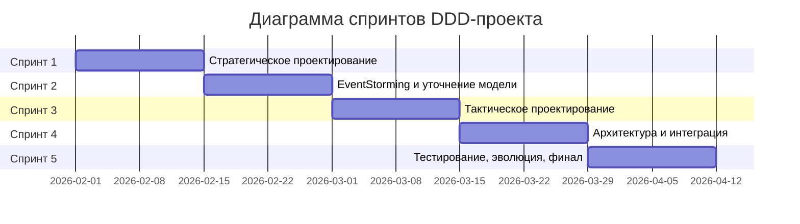
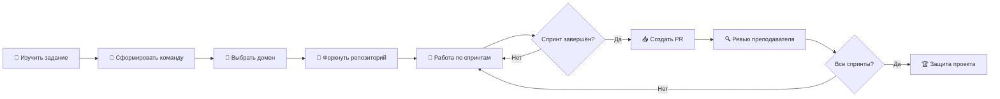

# 🎓 DDD Coursework — Domain-Driven Design

> *«Должно различать, что есть ложь и что неполная истина.»*  
> © Н. Лесков

Репозиторий для сквозного командного проекта по курсу **«Программная инженерия»**. Вы научитесь проектировать программные системы методами Domain-Driven Design (DDD) — от стратегического проектирования до тактических паттернов реализации.

---

## 📖 О курсе

| 📌 Параметр | 📝 Значение |
|-------------|-------------|
| **Преподаватель** | Роман Гордеев, доцент кафедры ИТ |
| **Курс** | Программная инженерия |
| **Формат** | Командный проект (2–4 человека) |
| **Длительность** | 10 недель (5 спринтов по 2 недели) |
| **Референс** | Влад Хононов. *Изучаем DDD — предметно-ориентированное проектирование* (БХВ-Петербург, 2024) |

📋 **Полное задание:** [`ddd-coursework.md`](ddd-coursework.md) — весь подробный регламент, шаблоны и критерии оценки.

---

## 🎯 Чему вы научитесь

В ходе проекта вы освоите:

- 🔍 **Анализ предметной области** — выделение поддоменов и их классификация
- 💬 **Единый язык (Ubiquitous Language)** — работа с экспертами и формирование глоссария
- 🗺️ **Bounded Contexts** — определение границ контекстов и построение карты контекстов
- ⚡ **EventStorming** — исследование домена через моделирование событий
- 🏗️ **Тактические паттерны** — агрегаты, сущности, объекты-значения, доменные сервисы
- 🔗 **Интеграция** — паттерны взаимодействия между контекстами
- ✅ **Тестирование** — выбор стратегии на основе архитектурных решений
- 🚀 **Эволюция** — планирование изменений и миграции системы

---

## 🗓️ План работы по спринтам



| № | Спринт | Тема | Главы книги | Артефакты |
|---|--------|------|-------------|-----------|
| 1 | Недели 1–2 | 🎯 **Стратегическое проектирование** | гл. 1–4 | Поддомены, BC Canvas, Context Map, Глоссарий |
| 2 | Недели 3–4 | ⚡ **EventStorming** | гл. 12, 2 | Доска ES, Каталог событий/команд |
| 3 | Недели 5–6 | 🧱 **Тактическое проектирование** | гл. 5–7 | Модель агрегатов, обоснование паттернов |
| 4 | Недели 7–8 | 🏗️ **Архитектура и интеграция** | гл. 8–9, 15 | Схемы архитектуры, контракты интеграции |
| 5 | Недели 9–10 | ✅ **Тестирование и эволюция** | гл. 10–11, 13, 16 | Тест-стратегия, План эволюции, Финальный документ |

---

## 📁 Структура репозитория

```
ddd-workbook/
├── 📄 README.md              # Этот файл — руководство для студентов
├── 📄 ddd-coursework.md      # Полное задание со всеми деталями
└── 📁 .sourcecraft/          # Служебные файлы (игнорировать)
```

### 📂 Рекомендуемая структура для команд

Каждая команда работает в **своём форке** репозитория. Рекомендуемая структура:

```
team-XX/                           # XX — номер команды
├── 📄 README.md                   # Описание проекта и домена команды
├── 📄 01-subdomains.md            # Спринт 1: Поддомены
├── 📄 02-contexts.md              # Спринт 1: Bounded Contexts
├── 📄 03-context-map.md           # Спринт 1: Карта контекстов
├── 📄 04-glossary.md              # Спринт 1: Глоссарий UL
├── 📄 05-eventstorming.md         # Спринт 2: EventStorming (ссылка на Miro/скриншот)
├── 📄 06-events-commands.md       # Спринт 2: Каталог событий и команд
├── 📄 07-aggregates.md            # Спринт 3: Модель агрегатов
├── 📄 08-architecture.md          # Спринт 4: Архитектура и интеграция
├── 📄 09-testing.md               # Спринт 5: Тестовая стратегия
├── 📄 10-evolution.md             # Спринт 5: План эволюции
├── 📄 final-report.md             # Итоговый документ
└── 📁 assets/                     # Скриншоты, диаграммы, изображения
    ├── eventstorming.png
    ├── context-map.png
    └── architecture.png
```

---

## 🚀 Начало работы

### 1️⃣ Форк репозитория

```bash
# 1. Нажмите кнопку "Fork" в правом верхнем углу этой страницы
# 2. Создайте форк в своём аккаунте или организации команды
```

### 2️⃣ Клонирование

```bash
# Клонируйте свой форк (замените USERNAME на имя своего аккаунта)
git clone https://github.com/USERNAME/ddd-workbook.git
cd ddd-workbook
```

### 3️⃣ Создание ветки команды

```bash
# Создайте ветку для вашей команды
git checkout -b team-01-main

# Где 01 — номер вашей команды
```

### 4️⃣ Работа над проектом

```bash
# Добавьте файлы вашего проекта
mkdir team-01
cd team-01
# ... создавайте файлы по спринтам ...

# Зафиксируйте изменения
git add .
git commit -m "📝 Спринт 1: добавлены поддомены и bounded contexts"

# Отправьте в свой форк
git push origin team-01-main
```

### 5️⃣ Сдача работы (Pull Request)

```bash
# После завершения спринта или финальной версии:
# 1. Перейдите в свой форк на GitHub
# 2. Нажмите "Contribute" → "Open pull request"
# 3. Укажите название: "Team XX: Sprint N" или "Team XX: Final"
# 4. Добавьте описание с кратким саммари
```

### 📌 Правила именования

| Объект | Формат | Пример |
|--------|--------|--------|
| Ветка команды | `team-XX-main` | `team-03-main` |
| Ветка спринта | `team-XX-sprint-N` | `team-03-sprint-2` |
| Коммит | `emoji описание` | `✨ Добавлена модель агрегатов` |
| PR | `Team XX: Sprint N` | `Team 05: Sprint 3` |

### 🎨 Gitmoji для коммитов (рекомендуется)

| Emoji | Значение |
|-------|----------|
| ✨ | Новый артефакт |
| 📝 | Документация |
| ♻️ | Рефакторинг |
| ✅ | Тесты или чек-лист |
| 🔧 | Конфигурация |
| 🐛 | Исправление ошибки |

---

## 📝 Шаблоны артефактов

В файле [`ddd-coursework.md`](ddd-coursework.md) вы найдёте 7 шаблонов для заполнения:

| № | Шаблон | Спринт | Описание |
|---|--------|--------|----------|
| 1 | **Таблица поддоменов** | 1 | Классификация: core/generic/supporting |
| 2 | **Bounded Context Canvas** | 1 | Описание каждого контекста |
| 3 | **Context Map** | 1 | Отношения и интеграция между контекстами |
| 4 | **Каталог событий и команд** | 2 | EventStorming-артефакты |
| 5 | **Модель агрегатов** | 3 | Сущности, VO, инварианты |
| 6 | **Выбор паттернов** | 4 | Бизнес-логика + архитектура + тесты |
| 7 | **План эволюции** | 5 | Сценарии изменений и миграции |

> 💡 **Совет:** Используйте Markdown-таблицы для заполнения шаблонов. Скопируйте шаблоны из [`ddd-coursework.md`](ddd-coursework.md) в свои файлы.

---

## ✅ Критерии оценки

### 📊 Рубрика (0–3 балла за критерий)

| Балл | Значение |
|------|----------|
| 0 | Не сделано или полностью неверно |
| 1 | Поверхностно, серьёзные ошибки, нет обоснования |
| 2 | Корректно, но есть пробелы в обосновании |
| 3 | Качественно, решения обоснованы через концепции книги |

### 🏆 Уровни выполнения

| Уровень | Баллы | Оценка | Что нужно |
|---------|-------|--------|-----------|
| 🥉 Минимальный | 10–15 | Удовл. | 1 BC, базовые артефакты |
| 🥈 Базовый | 16–20 | Хорошо | 2 BC, архитектура, тесты, эволюция |
| 🥇 Продвинутый | 21–24 | Отлично | + ES/CQRS/Сага/Data Mesh |

> 📖 Подробная рубрика: раздел 5 в [`ddd-coursework.md`](ddd-coursework.md)

---

## ❓ FAQ и полезные советы

### 🔥 Типичные проблемы

| Проблема | Решение |
|----------|---------|
| «Не можем выбрать домен» | Возьмите тот, где есть личный опыт у члена команды |
| «Всё кажется core-поддоменом» | Спросите: «Если конкурент сделает так же — потеряем преимущество?» |
| «Не можем найти конфликт терминов» | Рассмотрите одно понятие с точки зрения разных отделов |
| «Непонятно, где граница агрегата» | Ищите инварианты — правила в рамках одной транзакции |
| «Когда нужен доменный сервис?» | Только если логика не принадлежит ни одному агрегату |

### 🛠️ Инструменты для EventStorming

- [Miro](https://miro.com) — онлайн-доски
- [FigJam](https://www.figma.com/figjam/) — collaborative whiteboard
- [Lucidchart](https://www.lucidchart.com) — диаграммы
- [Draw.io](https://draw.io) — бесплатный вариант

### 📚 Дополнительные ресурсы

- 📖 Книга: Влад Хононов «Изучаем DDD» (БХВ-Петербург, 2024)
- 🌐 [DDD Community](https://www.dddcommunity.org/) — статьи и паттерны
- 🎥 [Vaughn Vernon](https://vaughnvernon.com/) — книги и видео

---

## 🔄 Процесс работы



---

## 📞 Контакты

| 👤 Кому | 📧 Как связаться |
|---------|------------------|
| **Преподаватель** | Роман Гордеев |
| **Консультации** | По договорённости (лично или онлайн) |
| **Вопросы по заданию** | Создайте Issue в этом репозитории |

---

## 📜 Лицензия и использование

Этот репозиторий предназначен для учебных целей в рамках курса «Программная инженерия». Материалы основаны на книге Влада Хононова «Изучаем DDD».

---

*Удачи в проекте! 🚀 Нет хороших решений — есть осознанные компромиссы.* 😉
